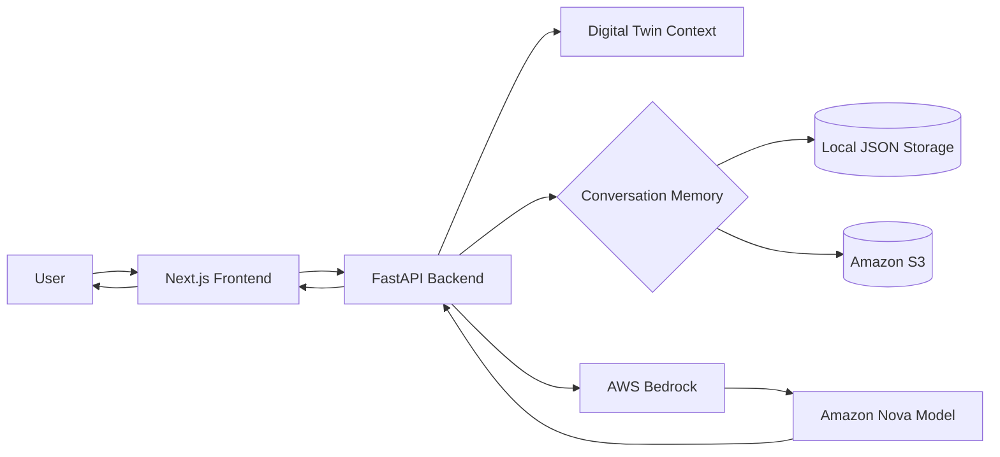
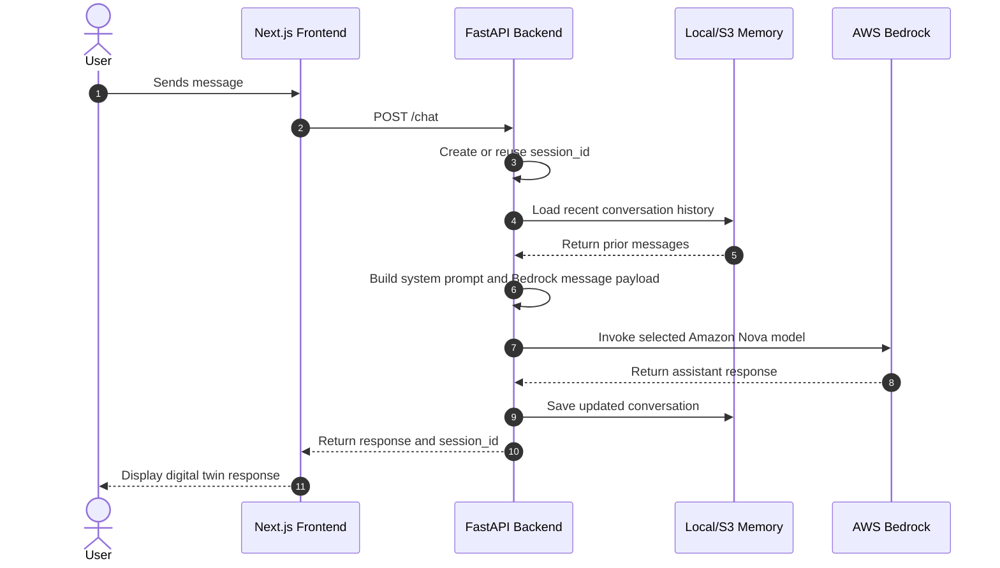
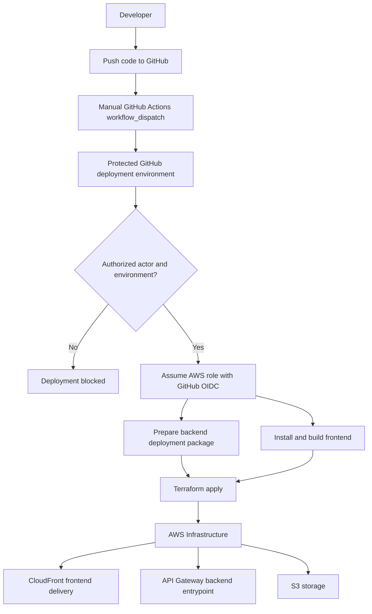
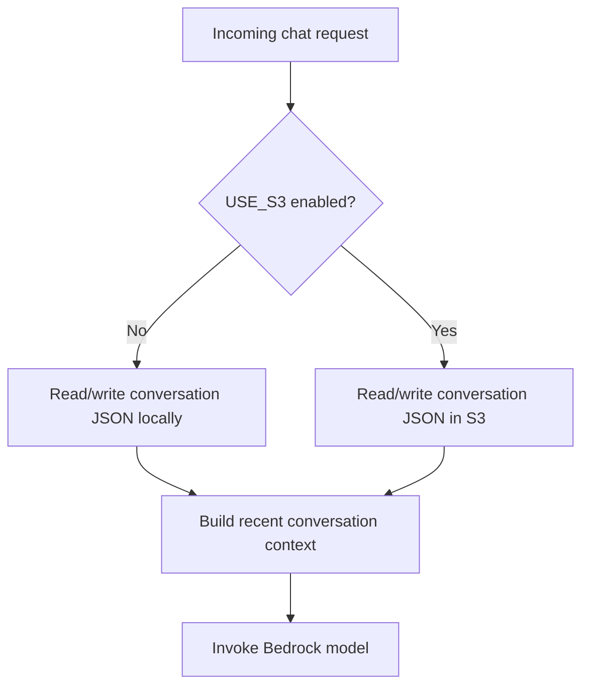

# AI Digital Twin

A full-stack AI assistant that represents Brian Kane using curated professional context, conversational memory, and AWS-hosted model inference.

This project is a portfolio-grade AI application built to demonstrate practical experience with modern web development, cloud deployment, infrastructure as code, controlled deployment from a public repository, and applied generative AI architecture.

The application exposes a conversational interface that answers as a professional digital twin, backed by a FastAPI service, AWS Bedrock, optional persistent memory, and a Next.js frontend.

## Why this project exists

The goal of this application is not to build a generic chatbot. It is to demonstrate how a software engineer can design, build, and deploy a focused AI product that combines:

- A clean frontend user experience.
- A typed backend API.
- Cloud-hosted LLM inference.
- Conversation memory.
- Environment-aware configuration.
- Infrastructure as code.
- Controlled deployment from a public repository.

For hiring managers and engineering reviewers, this repo is intended to show how I think about application structure, cloud deployment, operational safety, and AI-assisted user experiences.

## Core capabilities

- Conversational AI digital twin experience.
- FastAPI backend with typed request and response models.
- AWS Bedrock integration using Amazon Nova models.
- Configurable model selection for cost, latency, and quality tradeoffs.
- Conversation history using local storage or S3-backed persistence.
- Next.js frontend for the browser-based chat experience.
- Terraform-managed AWS infrastructure.
- GitHub Actions workflow for controlled deployments.
- Environment-specific deployment support for `dev`, `test`, `prod`, and `prod2`.
- Manual deployment workflow designed for public-repo safety.

## Architecture



## Runtime flow



## Deployment flow



## Technology stack

| Area | Technology |
|---|---|
| Frontend | Next.js, React, TypeScript, Tailwind CSS |
| Backend | Python, FastAPI, Pydantic, Uvicorn |
| AI runtime | AWS Bedrock, Amazon Nova |
| Memory | Local JSON storage or Amazon S3 |
| Cloud | AWS |
| Infrastructure | Terraform |
| CI/CD | GitHub Actions |
| Package/runtime tooling | Yarn, uv, Node.js, Python 3.12 |

## Repository structure

```text
.
├── .github/
│   └── workflows/        # Deployment workflow
├── backend/              # FastAPI application and digital twin context
├── frontend/             # Next.js frontend
├── scripts/              # Deployment helper scripts
├── terraform/            # AWS infrastructure as code
├── .env.example          # Example environment configuration
└── README.md
```

## Backend overview

The backend is a FastAPI service that provides the API layer for the digital twin experience.

Primary responsibilities:

- Accept chat messages from the frontend.
- Generate or reuse a session ID.
- Load prior conversation context.
- Build the model request using the digital twin prompt and recent messages.
- Invoke AWS Bedrock.
- Persist the updated conversation.
- Return the assistant response to the frontend.

Key endpoints:

| Endpoint | Method | Purpose |
|---|---:|---|
| `/` | GET | Basic service information |
| `/health` | GET | Health check and runtime configuration summary |
| `/chat` | POST | Main chat endpoint |
| `/conversation/{session_id}` | GET | Retrieve stored conversation history |

Example chat request:

```json
{
  "message": "Tell me about Brian's software engineering background.",
  "session_id": "optional-existing-session-id"
}
```

Example chat response:

```json
{
  "response": "Brian is a senior software engineer with experience across React, Java, backend services, cloud deployment, and applied AI systems...",
  "session_id": "generated-or-reused-session-id"
}
```

## AI model strategy

The backend uses AWS Bedrock with configurable Amazon Nova model IDs. The model can be selected through environment configuration, allowing the deployment to balance capability, cost, and latency without changing application code.

Example model options:

| Model | Use case |
|---|---|
| `amazon.nova-micro-v1:0` | Fastest and lowest-cost option |
| `amazon.nova-lite-v1:0` | Balanced default |
| `amazon.nova-pro-v1:0` | Stronger reasoning and generation quality |

## Memory strategy

Conversation memory can run in two modes:



Local memory is useful for development. S3-backed memory is useful for cloud deployment where application instances should not rely on local filesystem persistence.

## Infrastructure

Terraform is used to define and manage the AWS infrastructure required by the application. The deployment is designed around repeatable, environment-specific infrastructure rather than manual console configuration.

This is intentional: the project is meant to demonstrate production-minded engineering habits, not just a local prototype.

The GitHub Actions workflow supports manual deployment to:

- `dev`
- `test`
- `prod`
- `prod2`

Current active deployment target: `prod2`.

The `prod2` environment is intentionally retained because it matches the existing deployed AWS resources. The repository avoids casually renaming or migrating Terraform-managed resources from `prod2` to `prod`; that type of change would require an intentional state/resource migration plan.

## Environment variables

Create a local environment file from the example configuration and fill in the required values.

```bash
cp .env.example .env
```

Common configuration values:

| Variable | Purpose |
|---|---|
| `AWS_ACCOUNT_ID` | AWS account used for deployment |
| `DEFAULT_AWS_REGION` | AWS region, currently expected to be `us-east-2` unless changed |
| `PROJECT_NAME` | Project/application name |
| `BEDROCK_MODEL_ID` | Optional model override |
| `USE_S3` | Enables S3-backed conversation memory |
| `S3_BUCKET` | S3 bucket used for persisted memory |
| `MEMORY_DIR` | Local memory directory for development |
| `CORS_ORIGINS` | Allowed frontend origins |

Do not commit real credentials, secrets, or private environment files.

## Local development

### Backend

```bash
cd backend
uv sync
uv run uvicorn server:app --reload --host 0.0.0.0 --port 8000
```

The backend should then be available at:

```text
http://localhost:8000
```

Health check:

```bash
curl http://localhost:8000/health
```

### Frontend

```bash
cd frontend
yarn install --ignore-platform
yarn dev
```

The frontend should then be available at:

```text
http://localhost:3000
```

The `--ignore-platform` flag is used because Next.js includes platform-specific SWC packages. This keeps installs portable across Apple Silicon development machines and Linux-based GitHub Actions runners.

## Deployment

Deployment is handled through the GitHub Actions workflow. At a high level:

1. Select the target environment.
2. Run the manual deployment workflow.
3. GitHub Actions verifies the actor and protected deployment environment.
4. AWS credentials are configured through OIDC.
5. The deployment script runs.
6. Terraform applies the environment-specific infrastructure.
7. Outputs are printed for the deployed frontend and API resources.
8. The static frontend export is synced to S3 and served through CloudFront.

This repo intentionally does not treat deployment as a casual side effect of every commit. Deployments are explicit, environment-scoped, and controlled.

## Public repository deployment safety

This repository is intentionally public so hiring managers and technical reviewers can inspect the application code, Terraform configuration, deployment scripts, and GitHub Actions workflow.

The deployment scripts are visible, but they are not sufficient to deploy to my AWS account. Deployment requires:

- Write/admin access to this GitHub repository.
- Manual GitHub Actions workflow dispatch.
- Selection of the protected `prod2` deployment environment.
- GitHub environment protection for deployment approval.
- A GitHub OIDC token from this repository/environment.
- Permission to assume the AWS deployment role.
- AWS IAM permissions scoped to this project.

Forks and local clones can read or execute the scripts, but they cannot deploy to my AWS account without the protected GitHub/AWS trust chain.

## Security and operational considerations

This project is intentionally structured to avoid common public-repository risks:

- Secrets are expected to live in environment variables or GitHub/AWS secret stores.
- Real credentials should not be committed.
- Deployment is manual, not automatic on every push.
- Deployment is routed through protected GitHub environments.
- The GitHub Actions workflow includes an actor authorization check.
- AWS access is designed to use short-lived credentials through OIDC.
- Conversation memory can be moved to S3 for cloud persistence.
- CORS origins are configurable by environment.

Recommended hardening before production use:

- Remove verbose prompt/message logging from backend runtime logs.
- Add structured logging with request IDs.
- Add rate limiting for public endpoints.
- Add automated backend and frontend tests.
- Add request validation and abuse controls.
- Add CI checks for formatting, linting, tests, and security scanning.
- Review S3 retention and deletion behavior for conversation history.
- Add monitoring and alerting for API errors and Bedrock failures.
- Continue tightening AWS IAM permissions to the minimum required resources and actions.

## Engineering decisions

### Why FastAPI?

FastAPI provides a clean Python API layer with strong typing, Pydantic validation, and a simple development experience. It is a good fit for AI service orchestration because the backend can easily manage prompt construction, model calls, memory handling, and API responses.

### Why AWS Bedrock?

Bedrock allows the application to use managed foundation models without hosting model infrastructure directly. It also keeps model access inside AWS, which fits the broader cloud deployment strategy for this project.

### Why Terraform?

Terraform makes the infrastructure reviewable, repeatable, and environment-aware. For a portfolio project, this matters because it demonstrates cloud engineering discipline beyond simply deploying a demo.

### Why manual deployments?

Because this is a public repository connected to real cloud infrastructure. Manual deployments with an explicit actor check, protected GitHub environments, and OIDC-scoped AWS access are safer and more intentional than automatic deployment from every push.

## Current status

This is an active portfolio project. The core application structure is in place, including the frontend, backend, Bedrock integration, memory handling, Terraform infrastructure, and deployment workflow.

The next improvements are focused on polish, test coverage, observability, and production hardening.

## Planned improvements

- Add backend unit tests for chat, health checks, memory, and Bedrock request construction.
- Add frontend tests for chat behavior, loading states, and error states.
- Improve structured logging and remove verbose request/prompt logging.
- Add CI checks for linting, formatting, tests, and security scanning.
- Add architecture screenshots or a short demo GIF.
- Improve error handling for model access, validation failures, and AWS service errors.
- Add documented setup for each deployment environment.
- Add cost controls and monitoring for Bedrock usage.
- Reorder deployment script steps so frontend install/build can fail before Terraform apply.

## What this project demonstrates

This project demonstrates my ability to:

- Build full-stack applications with modern frontend and backend tooling.
- Integrate LLMs into real application workflows.
- Design AI systems with memory and context management.
- Use AWS services for cloud-hosted application architecture.
- Manage infrastructure with Terraform.
- Create controlled deployment workflows from a public repository.
- Think through security, deployment, and operational tradeoffs.
- Communicate technical architecture clearly.

## Author

Brian Kane  
Senior Software Engineer focused on full-stack development, cloud deployment, and applied AI engineering.
