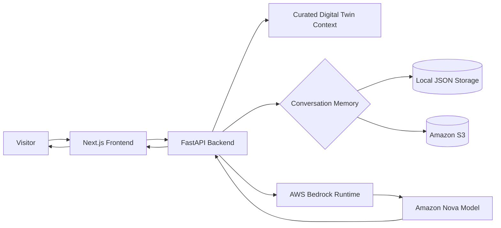
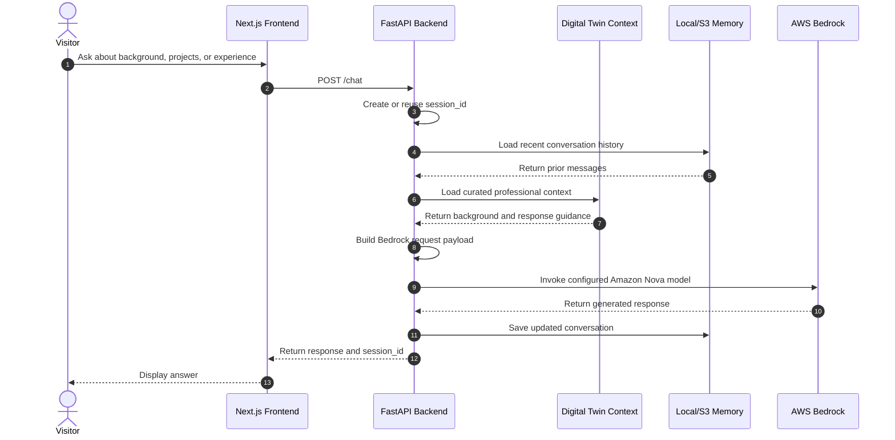
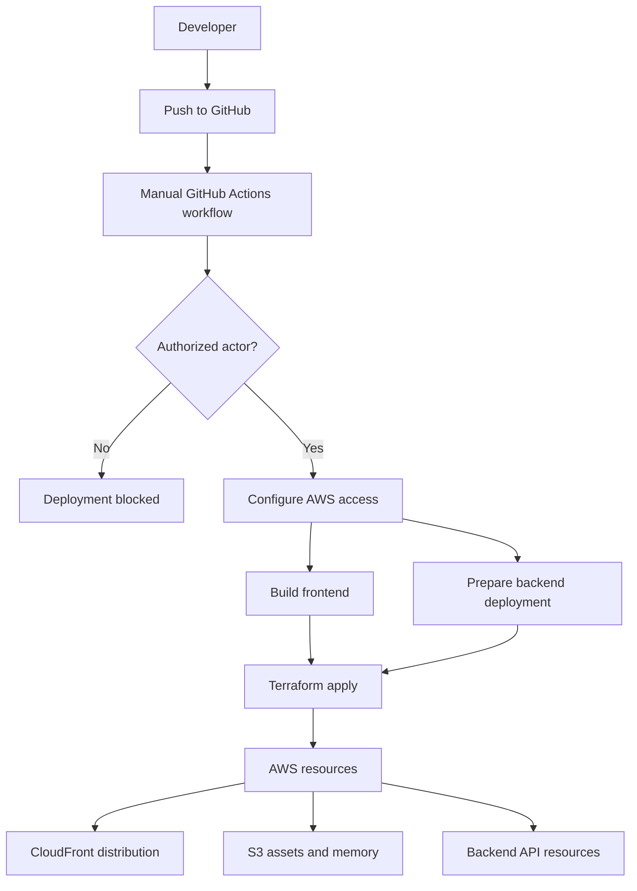
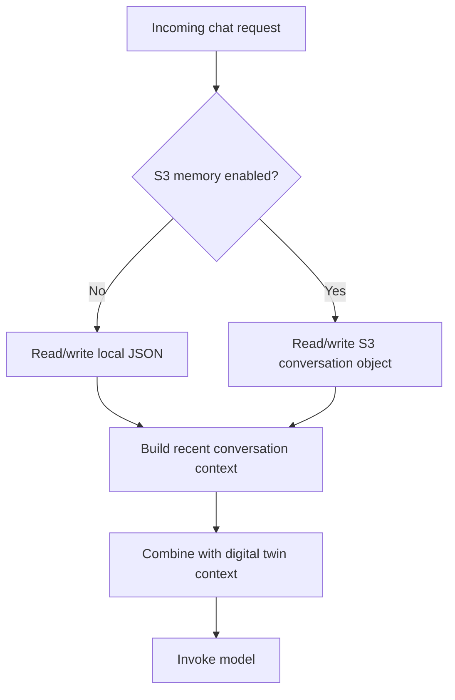

# AI Digital Twin

A live full-stack AI portfolio assistant built with Next.js, FastAPI, AWS Bedrock, Amazon Nova, Terraform, S3-backed conversation memory, CloudFront, and GitHub Actions.

This project demonstrates applied AI engineering through a practical product: a conversational assistant that represents Brian Kane using curated professional context, project information, resume material, and controlled model orchestration. It is designed for hiring managers, senior engineers, and architects who want to inspect both the user experience and the implementation behind it.

> This is not a generic chatbot demo. It is a cloud-deployed AI application that combines frontend UX, backend orchestration, model inference, conversation memory, infrastructure as code, and public-repo deployment controls.

## Live links

| Resource | Link |
|---|---|
| Portfolio site | [BrianEKane.com](https://www.brianekane.com) |
| Repository | [github.com/bkane56/twin](https://github.com/bkane56/twin) |

## At a glance

| Area | Details |
|---|---|
| Product | AI-powered portfolio assistant / professional digital twin |
| Frontend | Next.js, React, TypeScript |
| Backend | Python, FastAPI, Pydantic, Uvicorn |
| AI runtime | AWS Bedrock, Amazon Nova |
| Memory | Local JSON during development, S3-backed memory in cloud deployment |
| Infrastructure | Terraform |
| Cloud | AWS, CloudFront, S3, API-facing backend infrastructure |
| Deployment | GitHub Actions with controlled manual deployment |
| Primary audience | Hiring managers, senior engineers, architects, and technical recruiters |

## Why this project exists

A resume and portfolio site can show experience, but they are still static. This project adds an interactive layer: visitors can ask about my background, projects, technical decisions, healthcare experience, AI work, and engineering style.

The project is also intentionally built as a technical artifact. It demonstrates how I approach applied AI systems:

- Keep the user experience simple.
- Keep model calls behind a typed backend API.
- Keep professional context curated and inspectable.
- Keep deployment repeatable through infrastructure as code.
- Keep public-repo deployment controlled.
- Treat cost, logging, security, and operational risks as engineering concerns.

## Core capabilities

- Conversational AI digital twin experience.
- Curated professional context for grounded responses.
- FastAPI backend with typed request and response models.
- AWS Bedrock integration using Amazon Nova models.
- Configurable model selection for cost, latency, and quality tradeoffs.
- Conversation history using local or S3-backed persistence.
- Next.js frontend for browser-based interaction.
- Terraform-managed AWS infrastructure.
- Manual GitHub Actions deployment workflow.
- Environment-aware configuration for development and deployment.
- Public repository with deployment safeguards.

## Architecture



## Runtime request flow



## Deployment flow



## Memory strategy



Local memory keeps development simple. S3-backed memory supports cloud deployment where application instances should not depend on local filesystem persistence.

## Technology stack

| Layer | Technology |
|---|---|
| Frontend | Next.js, React, TypeScript |
| API | FastAPI, Python, Pydantic, Uvicorn |
| AI runtime | AWS Bedrock, Amazon Nova |
| State / memory | Session IDs, local JSON, S3-backed conversation storage |
| Infrastructure | Terraform |
| Deployment | GitHub Actions |
| Cloud | AWS, S3, CloudFront, Bedrock |
| Package/runtime tools | Yarn, uv, Node.js, Python 3.12 |

## Repository structure

```text
.
├── .github/
│   └── workflows/          # Deployment workflow
├── backend/                # FastAPI service and digital twin context
├── frontend/               # Next.js frontend
├── scripts/                # Deployment helper scripts
├── terraform/              # AWS infrastructure as code
├── .env.example            # Example environment configuration
└── README.md
```

## Backend overview

The backend is the orchestration layer for the AI experience.

Responsibilities:

- Accept chat messages from the frontend.
- Generate or reuse a session ID.
- Load recent conversation history.
- Load curated digital twin context.
- Build the model request for AWS Bedrock.
- Invoke the configured Amazon Nova model.
- Persist updated conversation history.
- Return the assistant response to the frontend.

Key endpoints:

| Endpoint | Method | Purpose |
|---|---:|---|
| `/` | GET | Basic service information |
| `/health` | GET | Runtime health check |
| `/chat` | POST | Main chat endpoint |
| `/conversation/{session_id}` | GET | Retrieve stored conversation history |

Example request:

```json
{
  "message": "Tell me about Brian's software engineering background.",
  "session_id": "optional-existing-session-id"
}
```

Example response:

```json
{
  "response": "Brian is a senior software engineer with enterprise full-stack experience and a current focus on applied AI systems...",
  "session_id": "generated-or-reused-session-id"
}
```

## AI model strategy

The backend uses AWS Bedrock with configurable Amazon Nova model IDs. This allows the application to balance capability, latency, and cost through configuration rather than code changes.

Example model profiles:

| Model | Use case |
|---|---|
| `amazon.nova-micro-v1:0` | Fastest and lowest-cost option |
| `amazon.nova-lite-v1:0` | Balanced default for many interactions |
| `amazon.nova-pro-v1:0` | Stronger reasoning and generation quality |

This is an intentional applied-AI design choice. Not every interaction requires the largest model, and the architecture should allow the model profile to evolve without rewriting the application.

## Local development

### Backend

```bash
cd backend
uv sync
uv run uvicorn server:app --reload --host 0.0.0.0 --port 8000
```

Health check:

```bash
curl http://localhost:8000/health
```

### Frontend

```bash
cd frontend
yarn install
yarn dev
```

Frontend development server:

```text
http://localhost:3000
```

Backend development server:

```text
http://localhost:8000
```

## Environment configuration

Create a local environment file from the example file:

```bash
cp .env.example .env
```

Common configuration values:

| Variable | Purpose |
|---|---|
| `AWS_ACCOUNT_ID` | AWS account used for deployment |
| `DEFAULT_AWS_REGION` | AWS region for deployment/runtime |
| `PROJECT_NAME` | Project/application name |
| `BEDROCK_MODEL_ID` | Optional Amazon Nova model override |
| `USE_S3` | Enables S3-backed conversation memory |
| `S3_BUCKET` | S3 bucket for persisted memory |
| `MEMORY_DIR` | Local memory directory for development |
| `CORS_ORIGINS` | Allowed frontend origins |

Do not commit real credentials, secrets, local `.env` files, or environment-specific Terraform variable files containing private account details.

## Deployment

Deployment is handled through a manual GitHub Actions workflow.

High-level flow:

1. Select the target environment.
2. Start the manual deployment workflow.
3. Verify the authorized actor.
4. Configure AWS access.
5. Build and deploy frontend/backend assets.
6. Apply Terraform infrastructure changes.
7. Review deployment outputs.

This repo intentionally avoids automatic production deployment from every push. Public repositories connected to real infrastructure should have explicit deployment controls.

## Security and operational considerations

This project is a portfolio application, but it is designed with production-minded habits:

- Secrets belong in environment variables, GitHub secrets, or AWS secret stores.
- Real credentials should never be committed.
- Public repo deployment should be manual and authorized.
- CORS should be configured per environment.
- Prompt and message logs should avoid exposing full user conversations.
- Conversation memory should have clear retention and deletion behavior before production use.
- Public endpoints should have rate limiting and abuse protection before broad exposure.
- AWS Bedrock usage should be monitored for cost and failure patterns.

## Known limitations

- This is a portfolio project, not a commercial digital twin platform.
- Response quality depends on curated context and selected model behavior.
- Conversation memory is intentionally lightweight.
- It does not currently include a formal evaluation harness for answer quality.
- Public usage should be protected with rate limiting and monitoring before scaling.
- The system should avoid logging sensitive user input in production.

## Planned improvements

- Add backend unit tests for chat, health, memory, and Bedrock request construction.
- Add frontend tests for chat behavior, loading states, and error states.
- Add structured logging with request IDs.
- Add rate limiting and abuse controls.
- Add CI checks for linting, formatting, tests, and security scanning.
- Add screenshots or a short demo GIF.
- Add a lightweight answer-quality evaluation checklist.
- Add cost monitoring for Bedrock usage.
- Document memory lifecycle and retention behavior.

## What this project demonstrates

This project demonstrates the ability to:

- Build full-stack AI applications with real frontend/backend separation.
- Integrate managed LLM inference through AWS Bedrock.
- Design session and memory handling for conversational UX.
- Use Terraform for repeatable cloud infrastructure.
- Deploy safely from a public GitHub repository.
- Think through cost, security, logging, and operational risks.
- Communicate architecture clearly to technical reviewers.
- Bring production software discipline to applied AI systems.

## Author

Brian E. Kane  
Full-Stack AI Engineer | Senior Software Engineer | Healthcare Technology  
[BrianEKane.com](https://www.brianekane.com) · [GitHub](https://github.com/bkane56) · [LinkedIn](https://www.linkedin.com/in/brian-kane-396a8862/)
